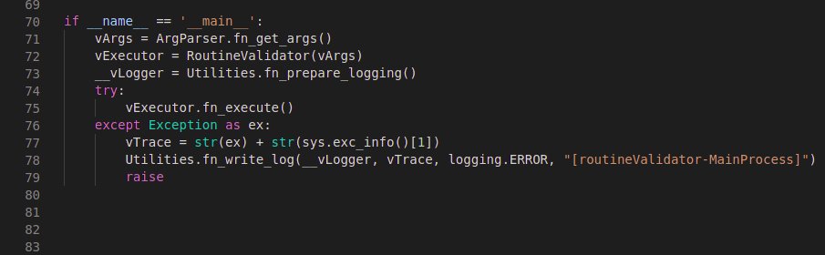

# class method

## ls

When you only need one instance of a class to execute method, probably what you really need is a class method, this allow you to execute a method without needing to instaciate the class.

## ls demo

